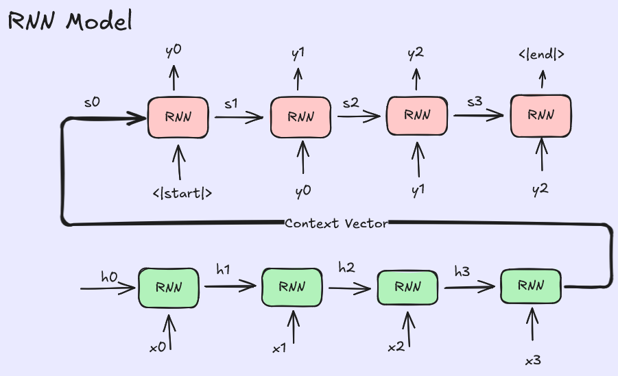
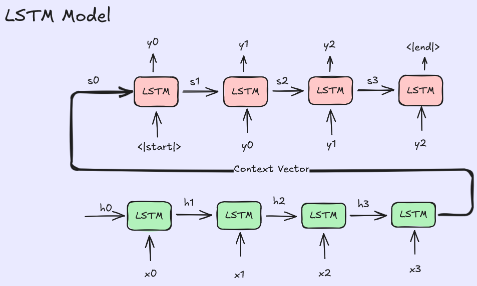
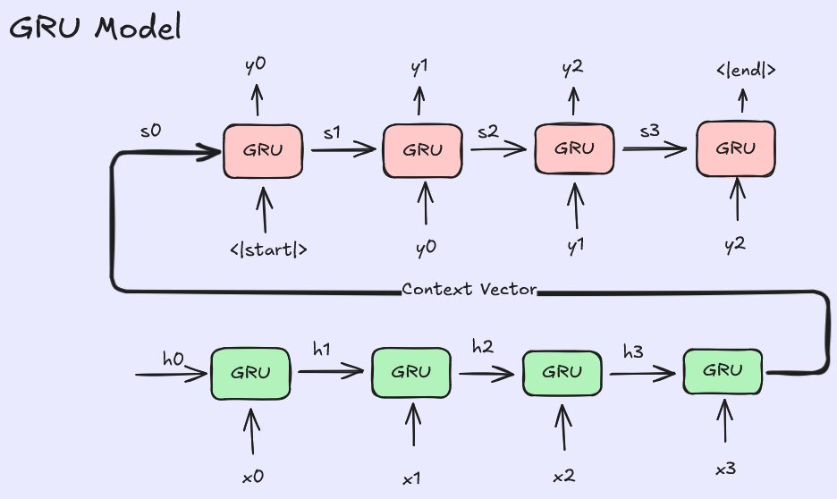
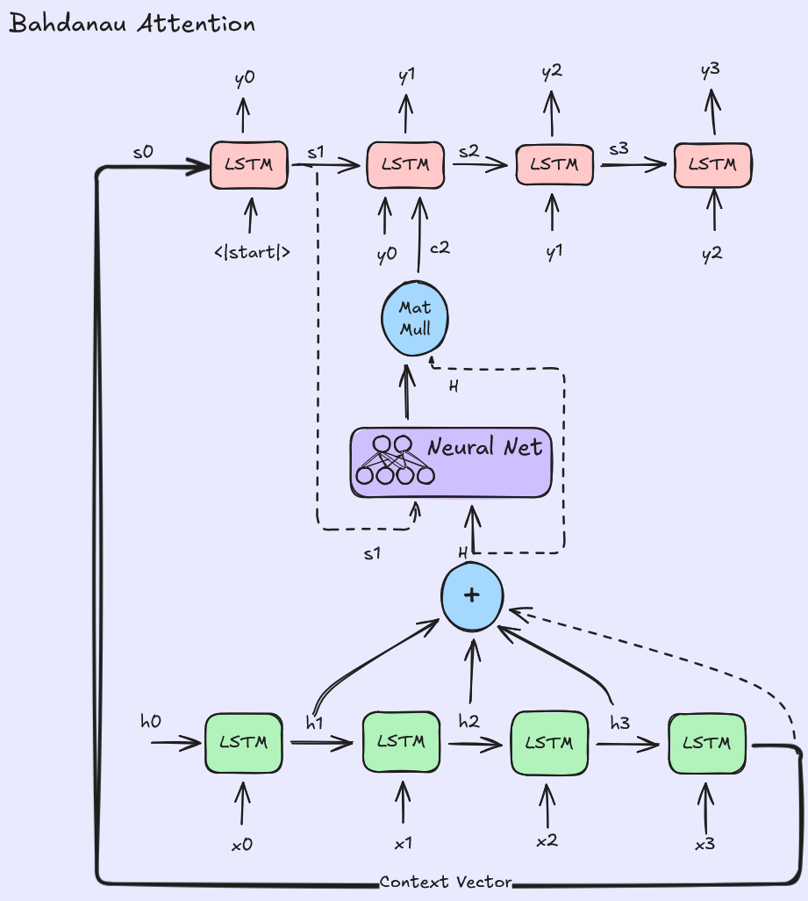
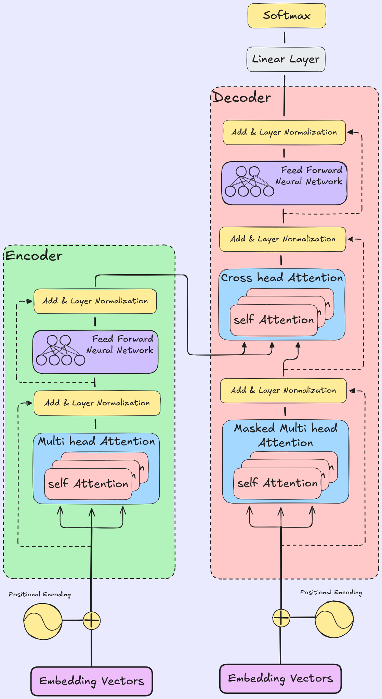

# Neural Network Architectures for Sequence Tasks

This repository contains implementations of various neural network architectures used for sequence-to-sequence tasks, such as machine translation. The models are currently trained on an **English to Hindi** translation task, but the codebase is flexible and can be adapted to any other language pair. **Inference code** is also included to demonstrate the translation capabilities. The table below provides a comparison of these models, highlighting their purposes, advantages, disadvantages, and the original papers they were introduced in.

## Model Comparison

| Model | Purpose | Pros & Cons | Image |
|:---|:---|:---|:---|
| **RNN** | Sequential data processing | **Pros:** Handles variable length input. **Cons:** Vanishing gradient problem; difficulty capturing long-term dependencies. **Paper:** [Rumelhart et al., 1986](https://www.nature.com/articles/323533a0) |  |
| **LSTM** | Address vanishing gradient in RNNs | **Pros:** Captures long-term dependencies; handles vanishing gradient problem better than RNNs. **Cons:** Complex structure; more parameters to train; slower than RNNs. **Paper:** [Hochreiter & Schmidhuber, 1997](https://www.bioinf.jku.at/publications/older/2604.pdf) |  |
| **GRU** | Simpler LSTM alternative | **Pros:** Faster training than LSTM; fewer parameters; comparable performance to LSTM. **Cons:** Can be less powerful than LSTM in some very deep or complex contexts. **Paper:** [Cho et al., 2014](https://arxiv.org/abs/1406.1078) |  |
| **Bahdanau Attention** | Dynamic focusing on source context | **Pros:** Improves performance on long sentences by focusing on relevant parts of input. **Cons:** Computationally expensive; alignment computed at every step. **Paper:** [Bahdanau et al., 2014](https://arxiv.org/abs/1409.0473) |  |
| **Luong Attention** | Refined attention mechanisms | **Pros:** Offers global and local attention mechanisms; different scoring functions. **Cons:** Complexity varies depending on the specific alignment function used. **Paper:** [Luong et al., 2015](https://arxiv.org/abs/1508.04025) |  |
| **Transformer** | Parallelized sequence processing | **Pros:** Highly parallelizable; captures global dependencies effectively; state-of-the-art results. **Cons:** Quadratic memory complexity with respect to sequence length; requires large amounts of data. **Paper:** [Attention is all you need, 2017](https://arxiv.org/abs/1706.03762) |  |

## Directory Structure
- `Architectures/`: Contains specific model implementations and diagrams.
- `data/`: Data storage.
- `model/`, `models/`, `runs/`: Checkpoints and training logs.
---
## MAP of Models Used
